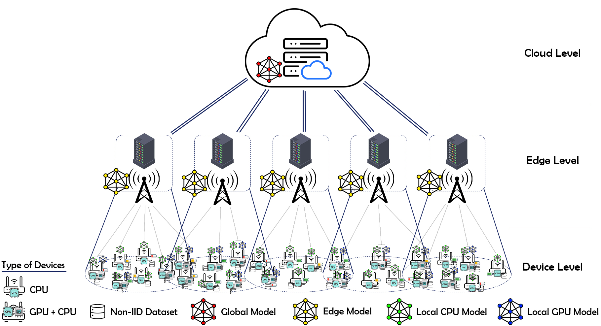

<a id="readme-top"></a>


<!-- PROJECT LOGO -->
<br />
<div align="center">
  <a href="">
    
  </a>

  <h1 align="center">Federated Learning Framework for Energy Usage of Clients Analysis</h1>

  <p align="center">
    An awesome simulation tool to jumpstart your optimization algorithms for analyzing clients' energy usage in federated learning!
    <br />
    "HFL-Energy is based on the <a href="https://github.com/LuminLiu/HierFL"><strong>HierFL</strong></a> framework"
    <br />
    <a href=""><strong>Explore the docs »</strong></a>
    <br />
    <br />
    <a href="">View Demo</a>
    ·
    <a href="">Report Bug</a>
    ·
    <a href="">Request Feature</a>
  </p>
</div>


<!-- TABLE OF CONTENTS -->
<details>
  <summary>Table of Contents</summary>
  <ol>
    <li>
      <a href="#about-the-project">About The Project</a>
      <ul>
        <li><a href="#built-with">Built With</a></li>
      </ul>
    </li>
    <li>
      <a href="#getting-started">Getting Started</a>
      <ul>
        <li><a href="#prerequisites">Prerequisites</a></li>
        <li><a href="#installation">Installation</a></li>
      </ul>
    </li>
    <li><a href="#usage">Usage</a></li>
    <li><a href="#roadmap">Roadmap</a></li>
    <li><a href="#contributing">Contributing</a></li>
    <li><a href="#license">License</a></li>
    <li><a href="#contact">Contact</a></li>
    <li><a href="#acknowledgments">Acknowledgments</a></li>
  </ol>
</details>


## Overview
<p style="text-align: justify;">
Hierarchical Federated Learning (HierFL) is an approach that extends traditional Federated Learning (FL) by introducing an additional layer of aggregation. Instead of a direct client-to-cloud aggregation, clients first aggregate their models at edge servers, and then the aggregated models are further aggregated at the cloud server. This hierarchical structure aims to reduce communication costs and improve scalability. Since the model training process takes place on user devices, and training tasks consume significant energy, it is important to manage the energy consumption of user devices, especially those that operate on batteries. The energy consumed on user devices includes both the energy used for model training and the energy required for uploading data over wireless communication networks.
</p>

  <a href="">
    
  </a>
<!-- HIERARCHICAL FEDERATED LEARNING -->
## Hierarchical Federated Learning (HierFL)

### Algorithm Flow

1. **Client Update (`t_1`)**: Clients perform local updates using their own data.
2. **Edge Aggregate (`t_2`)**: Clients send their updated models to the edge server, which aggregates these models.
3. **Cloud Aggregate (`t_3`)**: Edge servers send their aggregated models to the cloud server, which performs a final aggregation.

### Code Structure

- `client.py`: Contains the `Client` and `ClientProcessor` classes that handle client-side operations.
- `edge.py`: Contains the `Edge` class for edge server operations.
- `cloud.py`: Contains the `Cloud` class for cloud server operations.
- `datasets/get_data.py`: Handles data loading and distribution visualization.
- `models/`: Directory containing different model architectures.
- `client_selection.py`: Implements the client selection algorithms.
- `config/configloader.py`: Loads configuration settings for energy consumption and client selection.
- `constant.py`: Contains constants used in the code.
- `utils.py`: Contains utility functions.
- `custom_logging/setup_logger.py`: Sets up custom logging.
- `main.py`: The main entry point for running the HierFL algorithm.

## Installation

To set up the HierFL environment, follow these steps:

1. Clone the repository:
    ```sh
    git clone <repository_url>
    cd <repository_directory>
    ```

2. Install the required packages:
    ```sh
    pip install -r requirements.txt
    ```

## Running HierFL

To run the HierFL algorithm, execute the `main.py` script with the appropriate arguments. For example:
```sh
python main.py --dataset mnist --model lenet --num_clients 100 --num_edges 10 --num_local_update 10 --num_edge_aggregation 5 --num_communication 100 --batch_size 64 --lr 0.01 --lr_decay 0.99 --lr_decay_epoch 10 --momentum 0.9 --iid -2 --edgeiid 1 --cuda --gpu 0 --gpus 0 1
