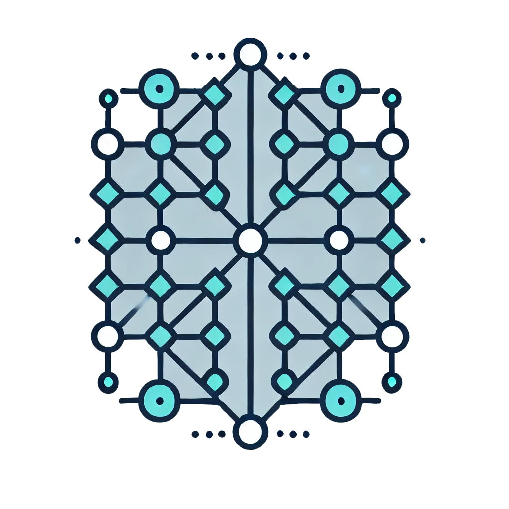

<!-- Improved compatibility of back to top link: See: https://github.com/othneildrew/Best-README-Template/pull/73 -->
<a id="readme-top"></a>
<!--
*** Thanks for checking out the Best-README-Template. If you have a suggestion
*** that would make this better, please fork the repo and create a pull request
*** or simply open an issue with the tag "enhancement".
*** Don't forget to give the project a star!
*** Thanks again! Now go create something AMAZING! :D
-->


<!-- PROJECT SHIELDS -->
<!--
*** I'm using markdown "reference style" links for readability.
*** Reference links are enclosed in brackets [ ] instead of parentheses ( ).
*** See the bottom of this document for the declaration of the reference variables
*** for contributors-url, forks-url, etc. This is an optional, concise syntax you may use.
*** https://www.markdownguide.org/basic-syntax/#reference-style-links
-->
[![Contributors][contributors-shield]][contributors-url]
[![Forks][forks-shield]][forks-url]
[![Stargazers][stars-shield]][stars-url]
[![Issues][issues-shield]][issues-url]
[![MIT License][license-shield]][license-url]
[![LinkedIn][linkedin-shield]][linkedin-url]


<!-- PROJECT LOGO -->
<br />
<div align="center">
  <a href="https://github.com/othneildrew/Best-README-Template">
    
  </a>

  <h3 align="center">Best-README-Template</h3>

  <p align="center">
    An awesome README template to jumpstart your projects!
    <br />
    <a href="https://github.com/othneildrew/Best-README-Template"><strong>Explore the docs »</strong></a>
    <br />
    <br />
    <a href="https://github.com/othneildrew/Best-README-Template">View Demo</a>
    ·
    <a href="https://github.com/othneildrew/Best-README-Template/issues/new?labels=bug&template=bug-report---.md">Report Bug</a>
    ·
    <a href="https://github.com/othneildrew/Best-README-Template/issues/new?labels=enhancement&template=feature-request---.md">Request Feature</a>
  </p>
</div>


<!-- TABLE OF CONTENTS -->
<details>
  <summary>Table of Contents</summary>
  <ol>
    <li>
      <a href="#about-the-project">About The Project</a>
      <ul>
        <li><a href="#built-with">Built With</a></li>
      </ul>
    </li>
    <li>
      <a href="#getting-started">Getting Started</a>
      <ul>
        <li><a href="#prerequisites">Prerequisites</a></li>
        <li><a href="#installation">Installation</a></li>
      </ul>
    </li>
    <li><a href="#usage">Usage</a></li>
    <li><a href="#roadmap">Roadmap</a></li>
    <li><a href="#contributing">Contributing</a></li>
    <li><a href="#license">License</a></li>
    <li><a href="#contact">Contact</a></li>
    <li><a href="#acknowledgments">Acknowledgments</a></li>
  </ol>
</details>


<!-- ABOUT THE PROJECT -->
## About The Project

<div align="center">
  <a href="">
    
    
  </a>
There are many great README templates available on GitHub; however, I didn't find one that really suited my needs so I created this enhanced one. I want to create a README template so amazing that it'll be the last one you ever need -- I think this is it.

Here's why:
* Your time should be focused on creating something amazing. A project that solves a problem and helps others
* You shouldn't be doing the same tasks over and over like creating a README from scratch
* You should implement DRY principles to the rest of your life :smile:

Of course, no one template will serve all projects since your needs may be different. So I'll be adding more in the near future. You may also suggest changes by forking this repo and creating a pull request or opening an issue. Thanks to all the people have contributed to expanding this template!

Use the `BLANK_README.md` to get started.

<p align="right">(<a href="#readme-top">back to top</a>)</p>


<!-- HIERARCHICAL FEDERATED LEARNING -->
## Hierarchical Federated Learning (HierFL)

### Overview

Hierarchical Federated Learning (HierFL) is an approach that extends traditional Federated Learning (FL) by introducing an additional layer of aggregation. Instead of a direct client-to-cloud aggregation, clients first aggregate their models at edge servers, and then the aggregated models are further aggregated at the cloud server. This hierarchical structure aims to reduce communication costs and improve scalability.

### Algorithm Flow

1. **Client Update (`t_1`)**: Clients perform local updates using their own data.
2. **Edge Aggregate (`t_2`)**: Clients send their updated models to the edge server, which aggregates these models.
3. **Cloud Aggregate (`t_3`)**: Edge servers send their aggregated models to the cloud server, which performs a final aggregation.

### Code Structure

- `client.py`: Contains the `Client` and `ClientProcessor` classes that handle client-side operations.
- `edge.py`: Contains the `Edge` class for edge server operations.
- `cloud.py`: Contains the `Cloud` class for cloud server operations.
- `datasets/get_data.py`: Handles data loading and distribution visualization.
- `models/`: Directory containing different model architectures.
- `client_selection.py`: Implements the client selection algorithms.
- `config/configloader.py`: Loads configuration settings for energy consumption and client selection.
- `constant.py`: Contains constants used in the code.
- `utils.py`: Contains utility functions.
- `custom_logging/setup_logger.py`: Sets up custom logging.
- `main.py`: The main entry point for running the HierFL algorithm.

## Installation

To set up the HierFL environment, follow these steps:

1. Clone the repository:
    ```sh
    git clone <repository_url>
    cd <repository_directory>
    ```

2. Install the required packages:
    ```sh
    pip install -r requirements.txt
    ```

## Running HierFL

To run the HierFL algorithm, execute the `main.py` script with the appropriate arguments. For example:
```sh
python main.py --dataset mnist --model lenet --num_clients 100 --num_edges 10 --num_local_update 10 --num_edge_aggregation 5 --num_communication 100 --batch_size 64 --lr 0.01 --lr_decay 0.99 --lr_decay_epoch 10 --momentum 0.9 --iid -2 --edgeiid 1 --cuda --gpu 0 --gpus 0 1
